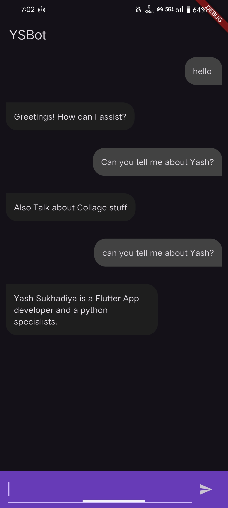
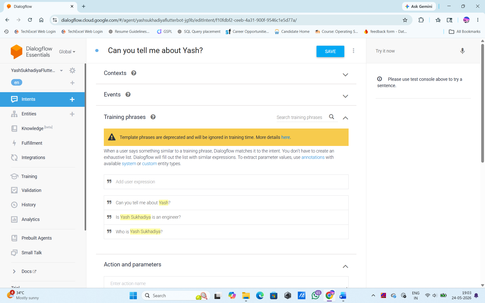
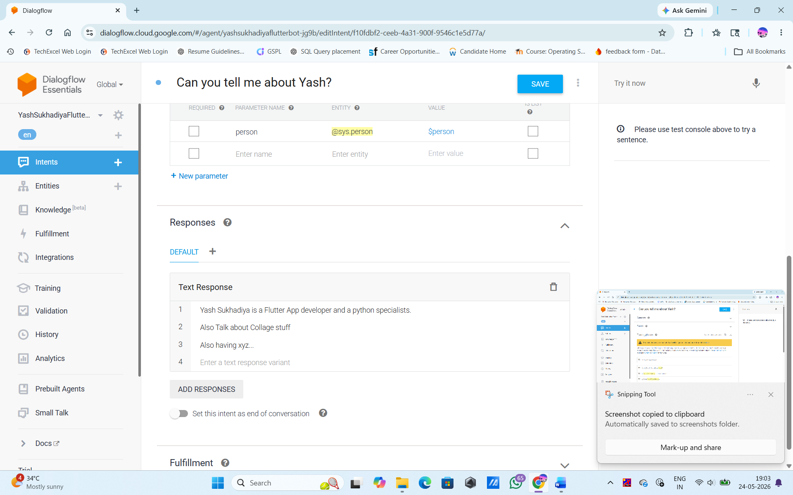

# YSBot - Flutter Dialogflow Chatbot

A Flutter chatbot app that uses Google Dialogflow to detect user intent and reply with AI-generated responses.

---

## Download APK

<p align="left">
  <a href="https://github.com/Yashsukhadiya1/flutter_bot/raw/main/apk/app-release.apk">
    
  </a>
</p>

---

## Screenshots

<p align="center">
  
  
  
  
</p>

---

## Why It Only Works on Chrome (Not on Phone)

This is the most important thing to understand about this project.

The app uses the `dialog_flowtter` package which communicates with the **Dialogflow API over HTTP**. When you run the app on a **physical Android/iOS device or emulator**, the API call goes out over the network — but the Dialogflow credentials in `assets/dialog_flow_auth.json` use a **service account key** that may be blocked or the CORS/network policy on mobile doesn't allow it the same way.

The real reason answers don't show on phone:

- On **Chrome (web)**, Flutter web runs in a browser which handles HTTP differently and the Dialogflow API call succeeds.
- On **Android/iOS**, if `response.message` comes back `null`, the bot silently does nothing (see `sendMessage` in `main.dart` — it returns early if `response.message == null`).
- This usually means the Dialogflow agent is not properly configured, the **service account JSON is wrong/expired**, or the **Dialogflow project has no matching intent** for your input.

### Fix for Phone

1. Open your Dialogflow console at https://dialogflow.cloud.google.com
2. Make sure your agent has intents with training phrases that match what you're typing.
3. Add a **Default Fallback Intent** so the bot always replies something.
4. Re-download the service account JSON from Google Cloud Console and replace `assets/dialog_flow_auth.json`.
5. Make sure the service account has the **Dialogflow API Client** role.

---

## Project Structure

```
flutter_bot/
├── lib/
│   ├── main.dart        # App entry, chat UI, Dialogflow logic
│   └── Messages.dart    # Chat bubble UI widget
├── assets/
│   ├── dialog_flow_auth.json         # (LOCAL ONLY) Google service account credentials (gitignored)
│   └── dialog_flow_auth.sample.json  # Template (safe to commit)
├── pubspec.yaml         # Dependencies
```

---

## How the Code Works

### `main.dart`

- `MyApp` — root widget, sets dark theme, loads `Home`.
- `Home` (StatefulWidget) — the main chat screen.
  - `initState`: loads Dialogflow credentials from `assets/dialog_flow_auth.json` using `DialogFlowtter.fromFile()`.
  - `build`: renders an `AppBar`, a scrollable message list (`MessagesScreen`), and a bottom input bar with a `TextField` and send button.
  - `sendMessage(text)`:
    1. Adds the user's message to the list immediately (shown on the right).
    2. Calls `dialogFlowtter.detectIntent()` with the typed text.
    3. If a response comes back, adds the bot's reply to the list (shown on the left).
  - `addMessage(message, isUserMessage)`: appends a message map to the `messages` list.

### `Messages.dart`

- `MessagesScreen` — takes the `messages` list and renders each one as a chat bubble.
- User messages align to the **right** with a dark grey bubble.
- Bot messages align to the **left** with a slightly lighter bubble.
- Bubble shape uses `BorderRadius` to give a WhatsApp-style rounded corner effect.

### `assets/dialog_flow_auth.json`

- This is your **Google Cloud service account key**.
- `dialog_flowtter` reads this file to authenticate with the Dialogflow API.
- Never commit this file to a repo — it contains private credentials.
- This project intentionally **gitignores** `assets/dialog_flow_auth.json`.
- Use `assets/dialog_flow_auth.sample.json` as a reference, then create your real
  `assets/dialog_flow_auth.json` locally.

---

## How to Run

### Prerequisites

- Flutter SDK installed — https://docs.flutter.dev/get-started/install
- A Google Dialogflow agent set up — https://dialogflow.cloud.google.com
- Service account JSON placed at `assets/dialog_flow_auth.json` (**do not commit it**)

### Steps

```bash
# 1. Install dependencies
flutter pub get

# 2. Run on Chrome (recommended — works reliably)
flutter run -d chrome

# 3. Run on Android (make sure emulator or device is connected)
flutter run -d android

# 4. Run on iOS (Mac only)
flutter run -d ios
```

### Check connected devices

```bash
flutter devices
```

---

## Dependencies

| Package | Purpose |
|---|---|
| `dialog_flowtter` | Connects to Google Dialogflow API |
| `flutter` | UI framework |
| `cupertino_icons` | iOS-style icons |

---

## Common Issues

**Bot doesn't reply on phone**
- Check that `dialog_flow_auth.json` is valid and not expired.
- Add a Default Fallback Intent in Dialogflow so there's always a response.
- Enable the Dialogflow API in your Google Cloud project.

**`response.message` is null**
- Dialogflow found no matching intent. Add more training phrases or a fallback intent.

**`DialogFlowtter` not initialized**
- `initState` loads it async. If you send a message too fast before it loads, it will crash. A fix is to add a loading state or null check before calling `detectIntent`.
